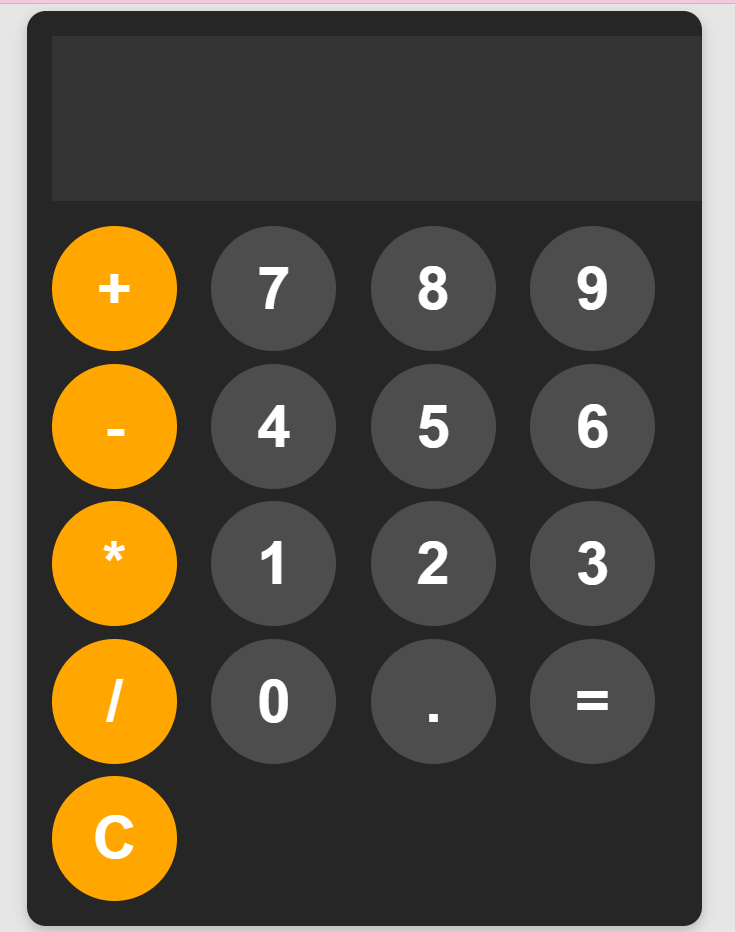

# 🧮 JavaScript Calculator

A responsive calculator built using **HTML**, **CSS**, and **Vanilla JavaScript**.

This project demonstrates DOM manipulation, event handling, error handling using `try/catch`, and deployment using GitHub Pages.

---

## 🚀 Live Demo

🔗 https://heruni99.github.io/js-calculator/

---

## 📸 Preview



---

## ✨ Features

- Perform basic arithmetic operations (+, −, ×, ÷)
- Real-time display updates
- Clear (C) button to reset input
- Error handling for invalid expressions
- Prevents crashes using `try/catch`
- Responsive layout (desktop & mobile)
- Clean modern UI with hover effects

---

## 🛠 Tech Stack

- HTML5
- CSS3
- JavaScript (Vanilla JS)
- Git & GitHub
- GitHub Pages (Deployment)

---

## 📂 Project Structure
.
├── index.html
├── styles.css
├── script.js
├── README.md
└── assets/
└── preview.png


---

## 💻 Run Locally

Clone the repository:

```bash
git clone https://github.com/heruni99/js-calculator.git

